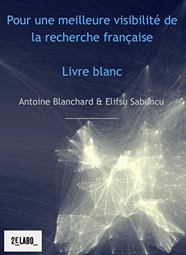
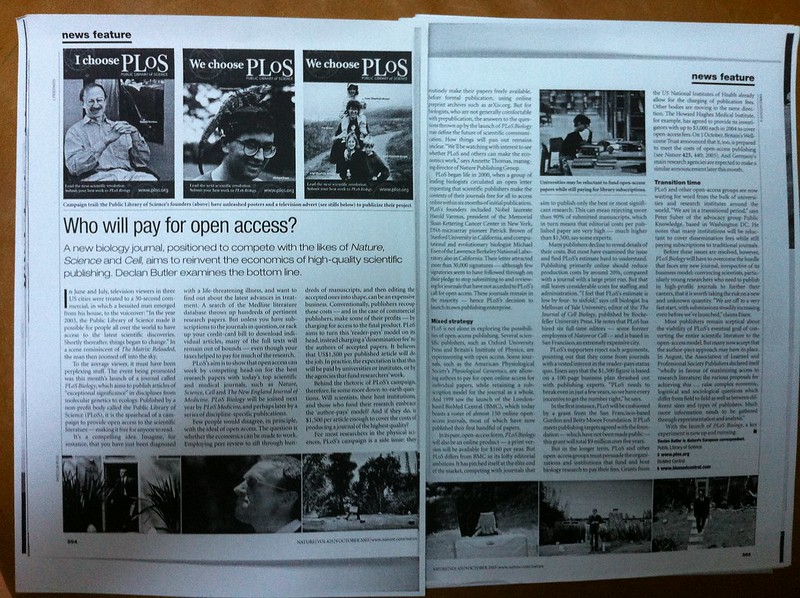
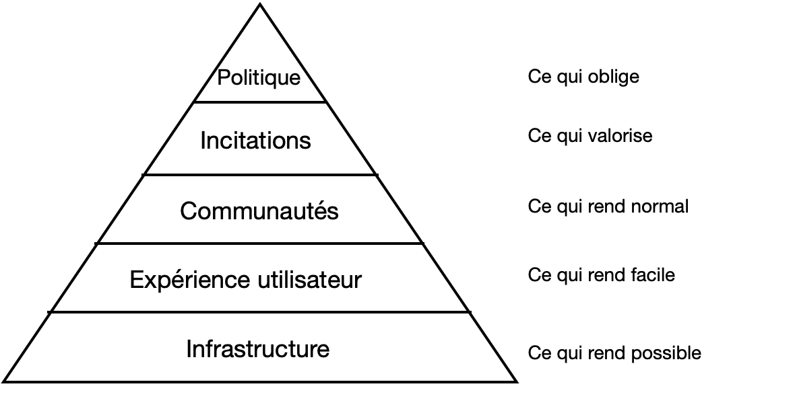
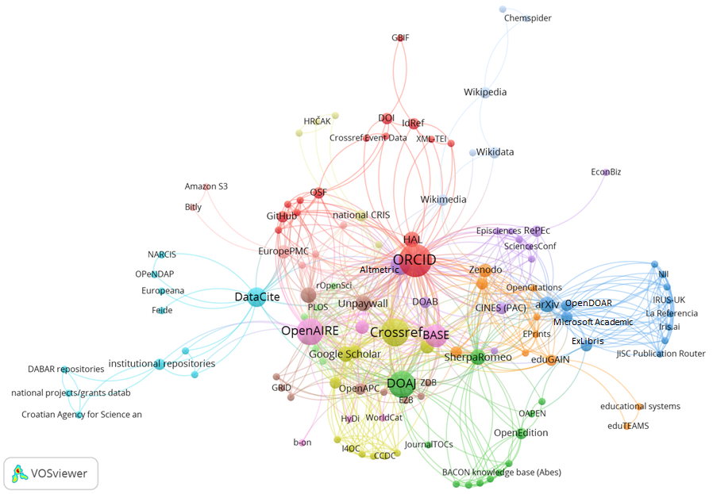
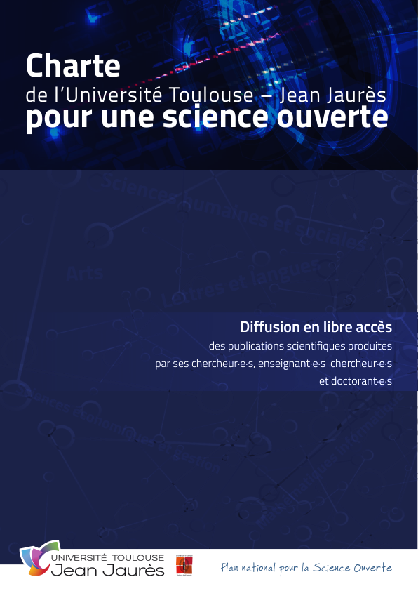
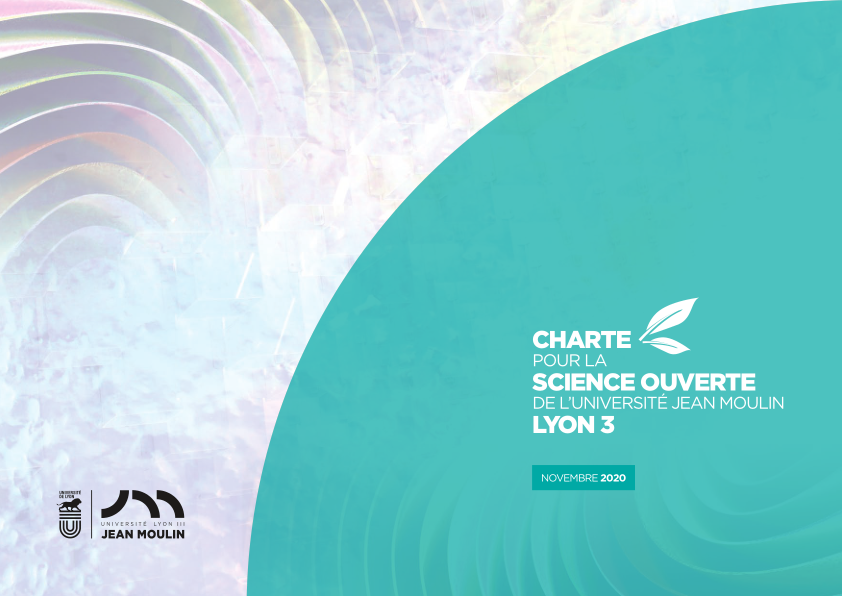
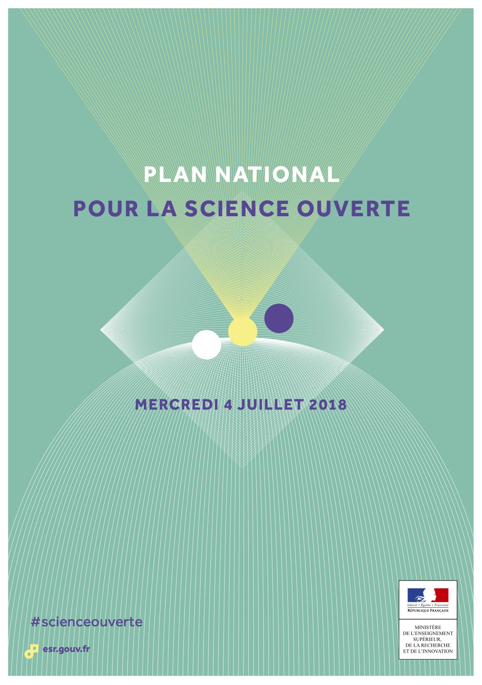

layout: true

`r paste0("
", params$event, " 

")`

---
class: center
# .red[La science ouverte, un changement institutionnel à conduire]
## Conférence-débat VPNum
### Antoine Blanchard, Datactivist
20 mai 2021

---

class: center, middle

Ces slides en ligne : `r paste0("http://datactivist.coop/", params$slug)`

Sources : `r paste0("https://github.com/datactivist/", params$slug)`

Les productions de Datactivist sont librement réutilisables selon les termes de la licence [Creative Commons 4.0 BY-SA](https://creativecommons.org/licenses/by-sa/4.0/legalcode.fr).

 
 

---
class:center,inverse, middle

# Qui suis-je ?

---
## Consultant chez Datactivist

Datactivist est une société coopérative qui se donne pour mission d’ouvrir les données et de les rendre utiles et utilisées.

J'accompagne les acteurs de l'ESR dans leur **stratégie open data et science ouverte**.

--

.pull-right[.reduite3[]]

.pull-left[## Observateur et acteur du numérique universitaire]

* 2009-2014 : Deuxième labo (**livre blanc sur le SI recherche**)
* 2014-2020 : Université de Bordeaux

---
## 2003 : je découvre la science ouverte avec *PLoS Biology*

.center[.reduite[]]

???

Je ne sais pas à quand remonte votre découverte de la science ouverte. Pour ma part c'est en 2003, j'étais étudiant et je suivais dans *Nature* l'aventure de la revue en accès ouvert et sous licence libre *PLoS Biology*.

---
class:center,inverse, middle

# Les enjeux de la science ouverte dans vos universités

---

## Deux petits sondages !

.center[.reduite[]]

???

- Quels aspects de la science ouverte sont importants pour mon université ?
- Quels aspects de la science ouverte est-ce que mon université soutient ?

---
class:center,inverse, middle

# Conduire le changement de la science ouverte

---

## Ce qu'il faut pour réussir ce changement

.center[.reduite[]]

.footnote[Adapté de Brian Nosek (2019), [“Strategy for Culture Change”](https://www.cos.io/blog/strategy-for-culture-change), Center for Open Science]

???

Un changement réussi doit combiner l'ensemble de ces changements. Ce sont comme les ingrédients d'une réussite. Nous allons passer en revue ces ingrédients.

---

## L'infrastructure : ce qui rend possible

### Quelques extraits de schémas directeurs numériques

À propos des datacenter :
> « lancer la construction d’un datacenter à l’état de l’art » pour faire face aux « besoins croissants des usagers, et de la Recherche en particulier, en termes de stockage, sauvegarde, archivage et sécurisation des données » (Université de Strasbourg)

> « un DataCenter qu’il reste à consolider en améliorant la sécurité d’hébergement des données, à augmenter la capacité de stockage » (Université de Nantes)

> « construction de la deuxième tranche du Datacenter » (Université de Bourgogne)

À propos de la couche de services :
> « promouvoir la diffusion des savoirs et la valorisation du patrimoine intellectuel produit à l’université comme les publications scientifiques ou les données de la recherche en développant des services dédiés à forte valeur ajoutée » (Université de Strasbourg)

???

J'en profite pour vous prier de m'envoyer votre SDN, c'est une matière très riche pour analyser les stratégies de transfonum du sup.

---
## L'infrastructure : ce qui rend possible

### Faire ou ne pas faire d'entrepôt institutionnel pour les données de la recherche ?

---
## L'infrastructure : ce qui rend possible

.pull-left[### Au niveau international, des infrastructures fortement interconnectées et économiquement fragiles]

.pull-right[.footnote[Ficarra, Victoria, Fosci, Mattia, Chiarelli, Andrea, Kramer, Bianca, & Proudman, Vanessa. (2020, October 30). Scoping the Open Science Infrastructure Landscape in Europe. Zenodo. http://doi.org/10.5281/zenodo.4159838]]

???

Exemples : ORCID, Crossref, OpenAIRE, DOAJ, BASE, Wikimedia, DataCite, OpenAIRE…

---

## L'expérience utilisateur : ce qui rend facile

### Exemple de HAL

<blockquote class="twitter-tweet">
<a href="https://twitter.com/totoroinparis?ref_src=twsrc%5Etfw">@totoroinparis</a> <a href="https://twitter.com/mapav8?ref_src=twsrc%5Etfw">@mapav8</a> <a href="https://twitter.com/yprie?ref_src=twsrc%5Etfw">@yprie</a> bon ce qui serait bien c&#39;est que HAL embauche un ergonome. Ou ait juste un peu de bon sens.
&mdash; Joel Gombin (@joelgombin) <a href="https://twitter.com/joelgombin/status/224530772827176960?ref_src=twsrc%5Etfw">July 15, 2012</a></blockquote> 

<blockquote class="twitter-tweet">
Refonte de l’ergonomie de <a href="https://twitter.com/hal_fr?ref_src=twsrc%5Etfw">@hal_fr</a> : les projets en cours <a href="https://twitter.com/hashtag/scienceouverte?src=hash&amp;ref_src=twsrc%5Etfw">#scienceouverte</a> <a href="https://twitter.com/hashtag/UrfistHAL_LO?src=hash&amp;ref_src=twsrc%5Etfw">#UrfistHAL_LO</a> <a href="https://twitter.com/nfargier?ref_src=twsrc%5Etfw">@nfargier</a> <a href="https://t.co/LKNfSeqAtR">pic.twitter.com/LKNfSeqAtR</a>
&mdash; CCSD (@ccsd_fr) <a href="https://twitter.com/ccsd_fr/status/1390242511935967232?ref_src=twsrc%5Etfw">May 6, 2021</a></blockquote> 

---

## L'expérience utilisateur : ce qui rend facile

### Accompagnement des chercheurs

<blockquote class="twitter-tweet" data-conversation="none">
Quand je lis <a href="https://twitter.com/marindacos?ref_src=twsrc%5Etfw">@marindacos</a> « Dans de nombreuses disciplines, il n’y a pas ou peu de culture de partage et de documentation des données », j&#39;ai envie de répondre : dans de nombreuses discipline on n&#39;y est pas formé et il n&#39;existe aucun soutien pour le faire. <a href="https://t.co/4GFrpE3NQx">https://t.co/4GFrpE3NQx</a>
&mdash; FX Coudert (@fxcoudert) <a href="https://twitter.com/fxcoudert/status/1225061583673593856?ref_src=twsrc%5Etfw">February 5, 2020</a></blockquote> 

Selon [une enquête de l'Université Rennes 2](https://hal.archives-ouvertes.fr/hal-01635186v2) :

> Au moins un tiers des personnes interrogées sollicitent explicitement l’appui d’ingénieurs pour les accompagner sur le plan technique dans le stockage et l’archivage de leurs données.

---

## Les communautés : ce qui rend normal

.pull-left[- La recherche a un fonctionnement collectif, ce sont les pairs qui fixent les normes et c'est l'imitation qui permet de faire évoluer les pratiques.

> "Pourquoi s'embêter à rendre un travail reproductible si personne ne me le demande ?"

- La bataille est quasiment gagnée sur le front des publications&nbsp;; elle  ne l'est pas encore sur le front des données.

- Les chercheurs senior (et pas les doctorants qu'on forme massivement) ont une responsabilité pour cela.

- Il est également possible de fédérer des "champions" de la science ouverte.]

.pull-right[.reduite3[]

[“Open Science Community Starter Kit”](http://www.startyourosc.com)]

???
Christophe Pouzat (2021), [“Recherche reproductible : c'est quoi ? Pourquoi en faire ? Comment ?”](https://www.societe-informatique-de-france.fr/wp-content/uploads/2021/05/journee-sif-repro-1-pouzat-recherche-repro.pdf), *Reproductibilité de la recherche*, Société informatique de France]

---

## Les incitations : ce qui valorise

L'acte de publier est indissociable de la science (Merton) : on le mesure et on le valorise. Ce qui n'est pas publié n'existe pas.

Alors quel est le statut des données qui ne sont pas partagées ? Est-ce que la science ouverte est déontologique ou est-ce qu'il est un bonus . Ceux qui ne le font pas n'ont ils pas une bonne conscience professionnelles ?

l'acte de publier ses données est également indissociable de la science, alors cela signifie qu'il faut 

(plus encore que de la bonne science), tout comme l Touche à la conscience professionnelle... s'ils ne le font pas

---

## Les politiques : ce qui oblige

### La Loi pour une république numérique prévoit :

- [Libre réutilisation des données publiées](https://www.legifrance.gouv.fr/jorf/article_jo/JORFARTI000033202841) :

> Dès lors que les données **issues d'une activité de recherche financée au moins pour moitié par des dotations de l'Etat**, des collectivités territoriales, des établissements publics, des subventions d'agences de financement nationales ou par des fonds de l'Union européenne ne sont **pas protégées par un droit spécifique ou une réglementation particulière** et qu'elles ont été **rendues publiques** par le chercheur, l'établissement ou l'organisme de recherche, **leur réutilisation est libre**.

- [Open data par défaut](https://www.legifrance.gouv.fr/jorf/article_jo/JORFARTI000033202965) :

> **Les administrations (…) publient en ligne (…) les bases de données**, mises à jour de façon régulière, qu'elles produisent.

Cet article s'applique aux données de la recherche ([interprétation endossée par le Ministère](https://www.ouvrirlascience.fr/wp-content/uploads/2018/11/Guide_Juridique_V2.pdf)).

???

Le premier article est une obligation imposée aux éditeurs pour permettre aux chercheurs de lutter efficacement contre les tentatives de monopolisation des jeux de données.

Le droit du producteur de bases de données ne peut faire obstacle à la réutilisation du contenu des bases de données que ces administrations publient.

---

## Les politiques : ce qui oblige

Au niveau local, une forte production de mandats de dépôt, de chartes, de politiques science ouverte

&nbsp;

---

## Conclusion

Les enjeux de la science ouverte sont loin d'être épuisés.

Ainsi, dans son rapport "Promouvoir et protéger une culture partagée de l'intégrité scientifique" (mars 2021), l'OPECST recommande :

>  Mieux identifier les processus par lesquels les objectifs poursuivis par la politique de la science ouverte peuvent aider au respect et à la promotion de l’intégrité scientifique ; **définir des normes d’archivage et de mise à
disposition des données de la recherche afin de garantir le contrôle par les pairs des productions scientifiques**.]

---

## Quelques jalons historiques
- **1933** : Ragnar Frisch : "in *Econometrica* the original raw data will, as a rule, be published, unless their volume is excessive. This is important in order to stimulate criticism, control, and further studies"

- **années 1970** : apparition du terme « open data » dans les accords signés par la NASA avec des pays partenaires en vue du partage de données satellites

- **1982** : lancement de Genbank, dont le succès a reposé sur son ouverture, par opposition à ses concurrents

- **1995** : rapport de la National Academy of Science intitulé _On the Full and Open Exchange of Scientific Data_

- **1996** : partage des données du Human Genome Project sous 24h (principes des Bermudes)

- **2003** : _Déclaration de Berlin sur le libre accès à la connaissance_ ([lien](https://openaccess.mpg.de/68042/BerlinDeclaration_wsis_fr.pdf))

- **2009** : affaire du "Climategate"

- **mars 2020** : article "Epidemiological data from the COVID-19 outbreak, real-time case information" ([lien](https://www.nature.com/articles/s41597-020-0448-0))

.footnote[[Samuel Goeta (2016), “Instaurer des données, instaurer des publics : une enquête sociologique dans les coulisses de l'open data”, Télécom ParisTech](https://pastel.archives-ouvertes.fr/tel-01458098)]

???

Ragnar Anton Kittil Frisch (Oslo, 3 mars, 1895 - 31 janvier, 1973), économiste norvégien et lauréat du premier prix dit Nobel d'économie décerné en 1969, est l'un des pères de l'économétrie, et le fondateur de la revue *Econometrica*.

"This was describing an epidemiological dataset about the spread of the virus, that was openly developed by researches working around the world in real-time as the pandemic was evolving. Researchers came from China, South America, the US, the UK and the rest of Europe to work on this, and it's still being updated continuously today. The editor tells me it was a unique challenge to peer review this article, as the dataset was changing minute by minute... but it really shows how the pandemic has brought international research groups together to collaborate and very quickly share data".
__ [Closed countries, open data](https://www.researchinformation.info/feature/closed-countries-open-data)

---
class:center,inverse, middle
### Définition de l'OCDE

« les données de la recherche sont définies comme des enregistrements factuels (chiffres, textes, images et sons), qui sont utilisés comme sources principales pour la recherche scientifique et sont généralement reconnus par la communauté scientifique comme nécessaires pour valider les résultats de la recherche »

.footnote[[*Principes et lignes directrices pour l’accès aux données de la recherche financée sur fonds publics*](http://www.oecd.org/fr/science/inno/38500823.pdf) (2007)]

---
class:center,inverse, middle

# Pourquoi ouvrir les données de la recherche&nbsp;?

---
## Des raisons scientifiques

La méthode scientifique évolue avec les données :

- branche 1 (déductive) : mathématiques, logique

- branche 2 (empirique) : analyse statistique, inductive, d'expériences avec groupe témoin

- **branche 3 (computationnelle)** : simulation à grande échelle utilisant les données

— Victoria Stodden (2010), "[The Digitization of Science and the Degradation of the Scientific Method](https://www.ischool.berkeley.edu/sites/default/files/VictoriaStoddenBIS2010.pdf)", UC Berkeley School of Information Dean's Lecture

???

Débat "The end of theory" toujours pas tranché.

---
## Des raisons éthiques

- norme de la communauté scientifique : "communalisme" (Merton)

- "accountability" et transparence : la science ne peut pas rester supérieure, elle doit rendre des comptes

- partage des ressources produites avec l'argent public

- responsabilité déontologique du chercheur :
>  face à cette dynamique de circulation des données relayée par leurs
autorités de tutelle et par leur communauté, **les chercheurs doivent prendre conscience de leur responsabilité individuelle, déontologique et éthique**, vis à vis de la communauté à laquelle ils appartiennent, avoir connaissance des engagements internationaux des institutions dont ils dépendent, connaître les limites des techniques d’exploitation des masses de données qu’ils utilisent et les difficultés d’interprétation qui en résultent. Il leur
appartient aussi de participer à la définition de bonnes pratiques propres à leur discipline dans le domaine du partage des données

— Comité d'éthique du CNRS (2015), [_Les enjeux éthiques du partage des données scientifiques_](https://comite-ethique.cnrs.fr/wp-content/uploads/2019/10/AVIS-2015-30.pdf), Avis n°2015-30

???

---
## Des raisons légales et institutionnelles

### À qui appartiennent les données de la recherche publique ?

- au chercheur

- à l'employeur

- à personne (domaine public)

- ça dépend

???

Le terme de données étant vaste (documents d'archives, œuvres, informations), il est impossible de répondre.

---

## Des raisons légales et institutionnelles

### À qui appartiennent les données expérimentales, d'observation, de simulation… de la recherche publique ?

- au chercheur

- à l'employeur

- à personne (domaine public)

- ça dépend

???

- données expérimentales : obtenues à partir d'équipements de laboratoire (séquençage…)
- données d'observation :  neuroimagerie, mesures physiques, reproduction photographique…
- données de simulation : simulation météorologique, sismique, économique…

Ces données ne sont  pas des « œuvres » couvertes par le droit d’auteur. Il peut y avoir un droit sui generis sur la base de données, droit dit de « producteur de base de données », qui appartient à l’entité qui a effectué des « investissements substantiels » rendant possible la base. Dans la plupart des hypothèses, ce seront donc les établissements de tutelle des chercheurs qui auront la qualité de « producteurs » et possèderont les droits attachés aux bases de données de recherche. 

---

## Des raisons légales et institutionnelles

### En 2016, que crée la Loi pour une république numérique ?

- un droit de réutiliser les données publiées

- une obligation de diffuser les données

- les deux

- je ne sais pas

???

Les deux !

---

## Des raisons légales et institutionnelles

- [Libre réutilisation des données publiées](https://www.legifrance.gouv.fr/jorf/article_jo/JORFARTI000033202841) :

> Dès lors que les données **issues d'une activité de recherche financée au moins pour moitié par des dotations de l'Etat**, des collectivités territoriales, des établissements publics, des subventions d'agences de financement nationales ou par des fonds de l'Union européenne ne sont **pas protégées par un droit spécifique ou une réglementation particulière** et qu'elles ont été **rendues publiques** par le chercheur, l'établissement ou l'organisme de recherche, **leur réutilisation est libre**.

- [Open data par défaut](https://www.legifrance.gouv.fr/jorf/article_jo/JORFARTI000033202965) :

> **Les administrations (…) publient en ligne (…) les bases de données**, mises à jour de façon régulière, qu'elles produisent.

[Cette interprétation a été endossée par le Ministère](https://www.ouvrirlascience.fr/wp-content/uploads/2018/11/Guide_Juridique_V2.pdf), à défaut de jurisprudence en la matière.

???

Le législateur permet ainsi aux chercheurs de lutter efficacement contre les tentatives de monopolisation des jeux de données par les éditeurs.

Le droit du producteur de bases de données ne peut faire obstacle à la réutilisation du contenu des bases de données que ces administrations publient.

---

## Des raisons légales et institutionnelles

### À l'origine de cette saisine CADA

.reduite.center[]

???
Le cadre juridique est important mais je ne veux pas en faire l'alpha et l'oméga d'une politique sur les données de la recherche. Ainsi, la réutilisation libre ne dit rien des pratiques de citation chères à la communauté scientifique.

---

## Des raisons légales et institutionnelles

.pull-left[
- ambition politique du Ministère de l'enseignement supérieur, de la recherche et de l'innovation
> Mesure 4 : Rendre obligatoire la diffusion ouverte des données de recherche issues de programmes financés par appels à projets sur fonds publics.
- politiques d'établissement pour la gestion des données de la recherche (ex. : Cirad)

- Déclaration de Berlin (2003) sur le libre accès aux "données brutes" (ex. : CNRS)]

.pull-right[
]

---
class:center,inverse, middle
## "Ouvert autant que possible, fermé autant que nécessaire"

.footnote[[*Recommandation 2018/790](https://eur-lex.europa.eu/legal-content/FR/TXT/PDF/?uri=CELEX:32018H0790&from=EN) de la Commission européenne du 25 avril 2018 relative à l'accès aux informations scientifiques et à leur conservation*]

???

"Les États membres devraient veiller à ce que les données de la recherche financée par des fonds publics deviennent et demeurent faciles à trouver,
accessibles, interopérables et réutilisables (principes FAIR) dans un environnement sécurisé et fiable, par l'intermédiaire d'infrastructures numériques (y compris celles fédérées au sein du nuage européen pour la science ouverte, le cas échéant), **sauf si cela se révèle impossible ou incompatible avec la poursuite de l'exploitation des résultats de recherche («aussi ouvert que possible, mais aussi fermé que nécessaire»). Il peut y avoir plusieurs raisons à cela, dont notamment le respect de la vie privée, les secrets industriels, la sûreté nationale, les intérêts commerciaux légitimes et les droits de propriété intellectuelle détenus par des tiers**. Ces politiques ou plans d'action nationaux ne devraient pas avoir d'incidence sur les données, le savoir-faire et/ou les informations, quelle que soit leur forme ou leur nature, qui sont détenus par des acteurs privés participant à un partenariat public-privé avant les activités de recherche"

---

class:center,inverse, middle

# Comment ouvrir les données de la recherche&nbsp;?

---

## Ce que le chercheur veut

- exploiter ses données pour obtenir des résultats publiables

Si il ou elle s'engage plus loin :

- des métadonnées "good enough" via un effort d'indexation raisonnable, simple et rapide

- si possible interopérabilité avec les instruments scientifiques, les cahiers de laboratoire… qui vont annoter de manière automatique

- être cité pour ses données, et que ce soit pris en compte dans son évaluation

- ne pas se faire doubler dans l'analyse de ses données

???

"Bien que très investies symboliquement par les chercheurs, les données semblent donc s’épuiser par le premier usage qu’ils en font (obtention des résultats) : la gestion des données n’est envisagée qu’à travers une vision à court terme."
— Philippe Amiel, Francesca Frontini, Pierre-Yves Lacour et Agnès Robin, « Pratiques de gestion des données de la recherche : une nécessaire acculturation des chercheurs aux enjeux de la science ouverte ? », Cahiers Droit, Sciences & Technologies [En ligne]. URL : http://journals.openedition.org/cdst/2061 ; DOI : https://doi.org/10.4000/cdst.2061

---

## Ce que le professionnel de l'information veut

- des métadonnées riches et fines

- un archivage pérenne avec identifiant unique

- un vocabulaire standardisé

---

## Ce que l'utilisateur veut

- pouvoir trouver et réutiliser facilement les données qui l'intéressent, y compris après quelques années

<iframe frameborder="0" width="750px" height="420px" style="position: fixed; top: 220px; left: 260px;" src="https://view.genial.ly/5d64fbbd8352350fa3d22603" type="text/html" allowscriptaccess="always" allowfullscreen="true" scrolling="yes" allownetworking="all"></iframe>

---
class:center,inverse, middle

# Pour quels usages ouvrir les données de la recherche&nbsp;?

---
## Des réutilisations académiques

- démultiplier les découvertes ("hypopublication", "undiscovered science")

- recherche reproductible

- équité vis-à-vis des pays du Sud (ex. : PubChem vs. Chemical Abstracts)

---
## Des réutilisations pédagogiques

&nbsp;
&nbsp;

.reduite.center[]

---

## Des réutilisations citoyennes

> Par exemple, sollicité au sujet du projet **Wikidata**, le CNRS a répondu que les chercheurs avaient des droits d’auteurs sur leur contribution, or une telle réponse impliquerait de contacter un par un les 8 800 chercheurs du CNRS afin de pouvoir réutiliser leurs contributions. Lorsque ces mêmes chercheurs publient leurs données sous licence libre, dans PLOS par exemple, on est obligé de passer par un intermédiaire privé (une fondation) pour récupérer des données financées sur des fonds public…

— Collectif (2012), « Open data en SHS », in *THATCamp Paris 2012*, Paris : Éditions de la Maison des Sciences de l'Homme, [http://editionsmsh.revues.org/364]()

???

En plus de l'exemple sur les données SARS-CoV2 citées précédemment.
---

## Des réutilisations industrielles

.reduite.center[]

---
class:center,inverse, middle

## "Barriers to effective data sharing and preservation are deeply rooted in the practices and culture of the research process as well as the researchers themselves."

.footnote[Carol Tenopir _et al._  (2011), "[Data Sharing by Scientists: Practices and Perceptions](https://doi.org/10.1371/journal.pone.0021101)", _PLoS ONE_, 6(6), e21101]

???

C'est un sujet complexe, profondément culturel, et tous les efforts sont les bienvenus !

---
class: inverse, center, middle

# Merci de votre attention

Contact : [antoine@datactivist.coop](mailto:antoine@datactivist.coop)

---
class:center,inverse, middle
count: false
# Table-ronde 

### François Sabot, directeur adjoint de la Mission science ouverte à l’IRD

### Cécile Pertuisot, gestionnaire de données océanographiques à l’Ifremer

### Bénédicte Wenden, chargée de recherche à l’Inrae
