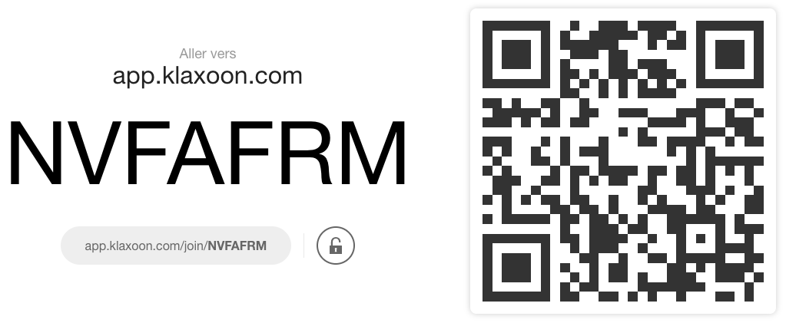

layout: true

`r paste0("
", params$event, " 

")`

---
class: center
# .red[La science ouverte, un changement institutionnel à conduire]
## Conférence-débat VPNum
### Antoine Blanchard, Datactivist
20 mai 2021

---

class: center, middle

Ces slides en ligne : `r paste0("http://datactivist.coop/", params$slug)`

Sources : `r paste0("https://github.com/datactivist/", params$slug)`

Les productions de Datactivist sont librement réutilisables selon les termes de la licence [Creative Commons 4.0 BY-SA](https://creativecommons.org/licenses/by-sa/4.0/legalcode.fr).

 
 

---
class:center,inverse, middle

# Qui suis-je ?

---
## Consultant chez Datactivist

Datactivist est une société coopérative qui se donne pour mission d’ouvrir les données et de les rendre utiles et utilisées.

J'accompagne les acteurs de l'ESR dans leur **stratégie open data et science ouverte**.

--

.pull-left[## Observateur et acteur du numérique universitaire]

* 2009-2014 : Deuxième labo (**livre blanc sur le SI recherche**)
* 2014-2020 : Université de Bordeaux

---
## 2003 : je découvre la science ouverte avec *PLoS Biology*

.center[.reduite[]]

???

Je ne sais pas à quand remonte votre découverte de la science ouverte. Pour ma part c'est en 2003, j'étais étudiant et je suivais dans *Nature* l'aventure de la revue en accès ouvert et sous licence libre *PLoS Biology*.

---
class:center,inverse, middle

# Les enjeux de la science ouverte dans vos universités

---

## Deux petits sondages !

.center[.reduite[]]

???

- Quels aspects de la science ouverte sont importants pour mon université ?
- Quels aspects de la science ouverte est-ce que mon université soutient ?

---
class:center,inverse, middle

# Conduire le changement de la science ouverte

---

## Ce qu'il faut pour réussir ce changement

.center[.reduite[]]

.footnote[Adapté de Brian Nosek (2019), [“Strategy for Culture Change”](https://www.cos.io/blog/strategy-for-culture-change), Center for Open Science]

???

Un changement réussi doit combiner l'ensemble de ces changements. Ce sont comme les ingrédients d'une réussite. Nous allons passer en revue ces ingrédients.

---

## L'infrastructure : ce qui rend possible

### Quelques extraits de schémas directeurs numériques

À propos des datacenter :
> « lancer la construction d’un datacenter à l’état de l’art » pour faire face aux « besoins croissants des usagers, et de la Recherche en particulier, en termes de stockage, sauvegarde, archivage et sécurisation des données » (Université de Strasbourg)

> « un DataCenter qu’il reste à consolider en améliorant la sécurité d’hébergement des données, à augmenter la capacité de stockage » (Université de Nantes)

> « construction de la deuxième tranche du Datacenter » (Université de Bourgogne)

À propos de la couche de services :
> « promouvoir la diffusion des savoirs et la valorisation du patrimoine intellectuel produit à l’université comme les publications scientifiques ou les données de la recherche en développant des services dédiés à forte valeur ajoutée » (Université de Strasbourg)

???

J'en profite pour vous prier de m'envoyer votre SDN, c'est une matière très riche pour analyser les stratégies de transfonum du sup.

---
## L'infrastructure : ce qui rend possible

### Faire ou ne pas faire d'entrepôt institutionnel pour les données de la recherche ?

Le MESRI a annoncé le 11 mai le lancement prochain d'un entrepôt national pour les données de la recherche : recherche.data.gouv.fr. Cet entrepôt sera confié à Inrae (chef de projet : Esther Dzale Yeumo) pour 3 ans d'incubation avant d'adopter sa forme définitive.

- Début 2022 : lancement de l'entrepôt
- 2022-2023 : campagnes d'alimentation avec les sites universitaires (ateliers de la donnée), des acteurs de l'édition et des archives ouvertes
- 2023-2024 : moissonnage d'entrepôts tiers

---
## L'infrastructure : ce qui rend possible

.pull-left[### Au niveau international, des infrastructures fortement interconnectées et économiquement fragiles]

.pull-right[.footnote[Ficarra, Victoria, Fosci, Mattia, Chiarelli, Andrea, Kramer, Bianca, & Proudman, Vanessa. (2020, October 30). Scoping the Open Science Infrastructure Landscape in Europe. Zenodo. http://doi.org/10.5281/zenodo.4159838]]

???

Exemples : ORCID, Crossref, OpenAIRE, DOAJ, BASE, Wikimedia, DataCite, OpenAIRE…

---

## L'expérience utilisateur : ce qui rend facile

### Exemple de HAL

.pull-left[
<blockquote class="twitter-tweet">
<a href="https://twitter.com/totoroinparis?ref_src=twsrc%5Etfw">@totoroinparis</a> <a href="https://twitter.com/mapav8?ref_src=twsrc%5Etfw">@mapav8</a> <a href="https://twitter.com/yprie?ref_src=twsrc%5Etfw">@yprie</a> bon ce qui serait bien c&#39;est que HAL embauche un ergonome. Ou ait juste un peu de bon sens.
&mdash; Joel Gombin (@joelgombin) <a href="https://twitter.com/joelgombin/status/224530772827176960?ref_src=twsrc%5Etfw">July 15, 2012</a></blockquote> 
]

--

.pull-right[
<blockquote class="twitter-tweet">
Refonte de l’ergonomie de <a href="https://twitter.com/hal_fr?ref_src=twsrc%5Etfw">@hal_fr</a> : les projets en cours <a href="https://twitter.com/hashtag/scienceouverte?src=hash&amp;ref_src=twsrc%5Etfw">#scienceouverte</a> <a href="https://twitter.com/hashtag/UrfistHAL_LO?src=hash&amp;ref_src=twsrc%5Etfw">#UrfistHAL_LO</a> <a href="https://twitter.com/nfargier?ref_src=twsrc%5Etfw">@nfargier</a> <a href="https://t.co/LKNfSeqAtR">pic.twitter.com/LKNfSeqAtR</a>
&mdash; CCSD (@ccsd_fr) <a href="https://twitter.com/ccsd_fr/status/1390242511935967232?ref_src=twsrc%5Etfw">May 6, 2021</a></blockquote> 
]

---

## L'expérience utilisateur : ce qui rend facile

### Accompagnement des chercheurs

.pull-left[
<blockquote class="twitter-tweet" data-conversation="none">
Quand je lis <a href="https://twitter.com/marindacos?ref_src=twsrc%5Etfw">@marindacos</a> « Dans de nombreuses disciplines, il n’y a pas ou peu de culture de partage et de documentation des données », j&#39;ai envie de répondre : dans de nombreuses discipline on n&#39;y est pas formé et il n&#39;existe aucun soutien pour le faire. <a href="https://t.co/4GFrpE3NQx">https://t.co/4GFrpE3NQx</a>
&mdash; FX Coudert (@fxcoudert) <a href="https://twitter.com/fxcoudert/status/1225061583673593856?ref_src=twsrc%5Etfw">February 5, 2020</a></blockquote> 
]

--

.pull-right[
Selon [une enquête de l'Université Rennes 2](https://hal.archives-ouvertes.fr/hal-01635186v2) (2017) :

> Au moins un tiers des personnes interrogées sollicitent explicitement l’appui d’ingénieurs pour les accompagner sur le plan technique dans le stockage et l’archivage de leurs données.
]
---

## Les communautés : ce qui rend normal

.pull-left[- La recherche a un fonctionnement collectif, c'est la communauté qui fixe les normes et c'est l'imitation qui permet de faire évoluer les pratiques (ou de sanctionner les déviances).

- La bataille est quasiment gagnée sur le front des publications&nbsp;; elle  ne l'est pas encore sur le front des données.

- Les chercheurs senior (et pas les doctorants qu'on forme massivement) ont une responsabilité.

- Il est également possible de fédérer des "champions" de la science ouverte.]

.pull-right[.reduite3[]

[“Open Science Community Starter Kit”](http://www.startyourosc.com)]

???
La publication est une norme de la communauté (ou de l'éthos de la science selon R. K. Merton).

---

## Les incitations : ce qui valorise

> "Pourquoi s'embêter à rendre un travail reproductible si personne ne me le demande ?"

>– Christophe Pouzat (2021), [“Recherche reproductible : c'est quoi ? Pourquoi en faire ? Comment ?”](https://www.societe-informatique-de-france.fr/wp-content/uploads/2021/05/journee-sif-repro-1-pouzat-recherche-repro.pdf)

Science ouverte ou recherche reproductible : il est nécessaire de valoriser les comportements vertueux en science quand ils ont un coût (en temps, en argent...).

À l'Université de Liège, qui a souvent été érigée en modèle, le dépôt n’est pas « obligatoire », mais l’évaluation des chercheurs (pour les demandes de promotions) et l’attribution des crédits ne prennent en compte que ce qui est déposé dans l'archive ouverte. 

Mais en France, le suivi de carrière est national.

Quelques pistes pour les universités :
- donner des instructions aux comités de visite HCÉRES
- prendre en compte la science ouverte dans l'évaluation de projets / l'attribution de crédits
- financer des mini-bourses pour des activités de science ouverte

???

L'évaluation des unités revêt un caractère collectif qui permet de gommer les différences inter-individuelles.

Mini-bourses : exemple tiré de la feuille de route SO d'Utrecht University https://www.uu.nl/sites/default/files/utrecht-university-open-science-programme.pdf

---

## Les politiques : ce qui oblige

### La Loi pour une république numérique prévoit :

- [Libre réutilisation des données publiées](https://www.legifrance.gouv.fr/jorf/article_jo/JORFARTI000033202841) :

> Dès lors que les données **issues d'une activité de recherche financée au moins pour moitié par des dotations de l'Etat**, des collectivités territoriales, des établissements publics, des subventions d'agences de financement nationales ou par des fonds de l'Union européenne ne sont **pas protégées par un droit spécifique ou une réglementation particulière** et qu'elles ont été **rendues publiques** par le chercheur, l'établissement ou l'organisme de recherche, **leur réutilisation est libre**.

- [Open data par défaut](https://www.legifrance.gouv.fr/jorf/article_jo/JORFARTI000033202965) :

> **Les administrations (…) publient en ligne (…) les bases de données**, mises à jour de façon régulière, qu'elles produisent.

Cet article s'applique aux données de la recherche ([interprétation endossée par le Ministère](https://www.ouvrirlascience.fr/wp-content/uploads/2018/11/Guide_Juridique_V2.pdf)).

???

Le premier article est une obligation imposée aux éditeurs pour permettre aux chercheurs de lutter efficacement contre les tentatives de monopolisation des jeux de données.

Le droit du producteur de bases de données ne peut faire obstacle à la réutilisation du contenu des bases de données que ces administrations publient.

---

## Les politiques : ce qui oblige

Au niveau local, une forte production de mandats de libre accès, de chartes, de politiques science ouverte…

&nbsp;

???

---

## Conclusion

Les enjeux de la science ouverte sont loin d'être épuisés.

Ainsi, dans son rapport "Promouvoir et protéger une culture partagée de l'intégrité scientifique" (mars 2021), l'OPECST recommande :

>  Mieux identifier les processus par lesquels les objectifs poursuivis par la politique de la science ouverte peuvent aider au respect et à la promotion de l’intégrité scientifique ; **définir des normes d’archivage et de mise à
disposition des données de la recherche afin de garantir le contrôle par les pairs des productions scientifiques**.]